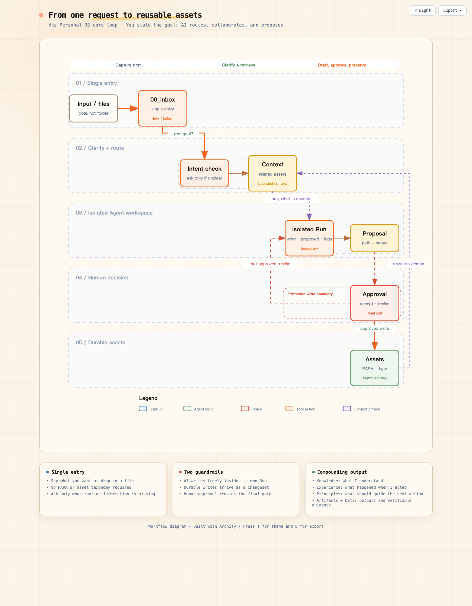
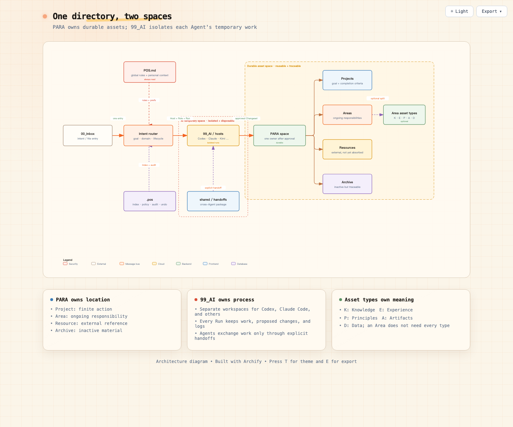
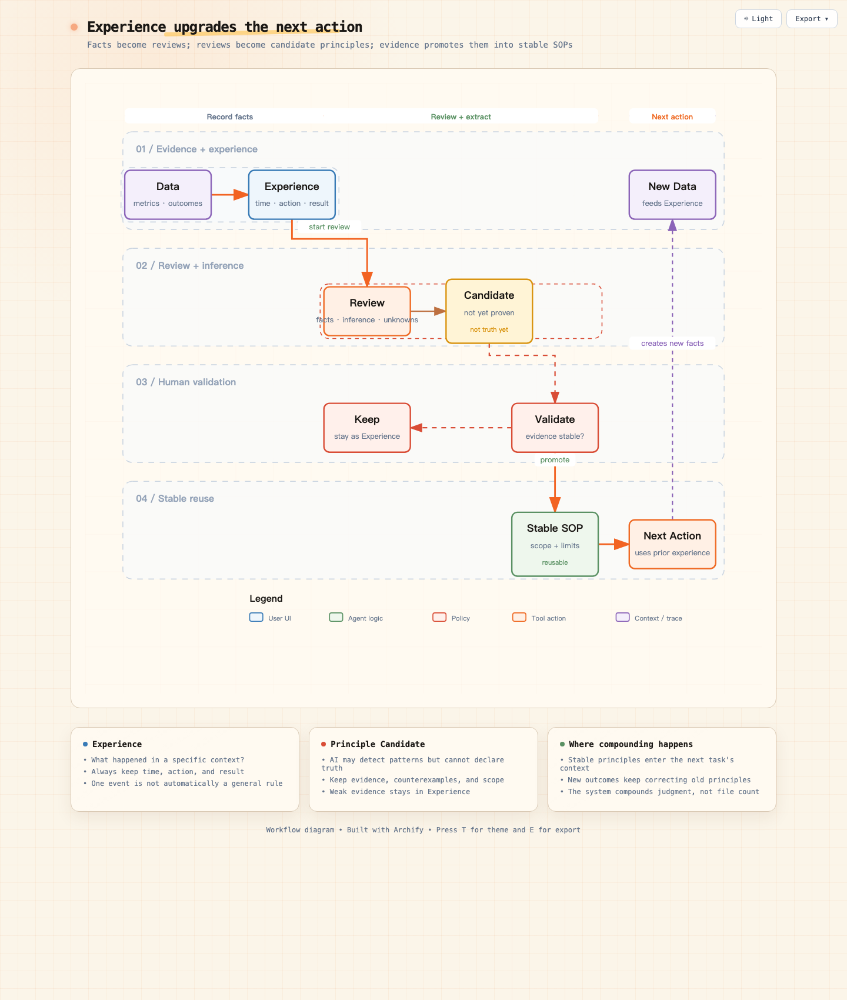
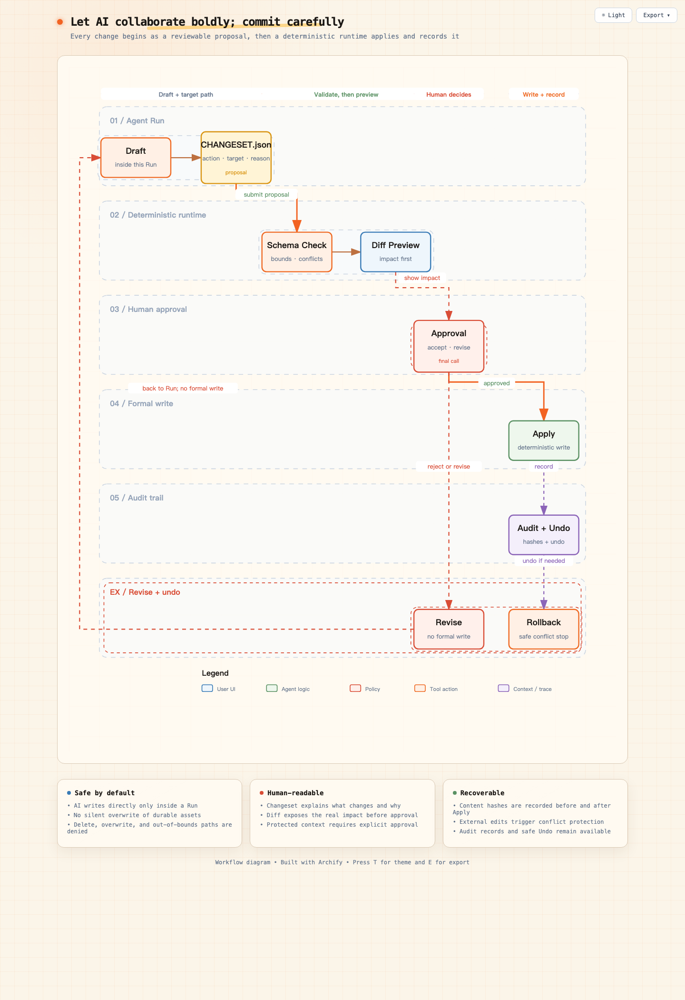

# Hks Personal OS

[简体中文](README.md) · [繁體中文](README.zh-TW.md) · **English**

[](https://github.com/HANKSEN/hks-personal-os/releases/tag/v1.1.0)
[](SKILL.md)
[](https://github.com/HANKSEN/hks-personal-os/tree/main/tests)
[](https://nodejs.org/)
[](LICENSE)
[](LICENSE-DOCS.md)

> A local-first, Agent-native personal information operating system that turns experience and outcomes from real tasks into personal context that can be retrieved and corrected next time.

**A Skill creates one result. Hks Personal OS makes that result valuable again.**

It keeps AI from meeting you from scratch every time—without letting it take over your files. When a task ends, its experience stays available for the next one.

Hks Personal OS helps AI practitioners build a working system for continuously retrieving, reusing, and evolving personal assets.

Personal OS combines a Markdown file system, an Agent Skill, and a deterministic local runtime embedded in that Skill. PARA defines physical ownership; `Knowledge / Experience / Principles / Artifacts / Data` define asset meaning; isolated Runs and reviewable Changesets protect formal files. A global `pos` CLI is optional.

## Who I am: Hanksen

**Definer and practitioner of the Individual Cognitive Compounding System: helping individuals and organizations turn AI from an answer generator into a capability-growth system continuously calibrated by real action.**

Others teach you how to use AI and tools. I provide the operating system that lets every AI practice accumulate into individual or organizational capability, turning each AI practice into an asset you own.

> [!WARNING]
> Before authorizing any Agent to access valuable files, create a complete independent backup and restore-test it. Changesets, Undo, Git, and cloud history are not substitutes for a backup. Read the [safety and disclaimer guide](docs/safety.en.md).

## Install

Give the [GitHub repository URL](https://github.com/HANKSEN/hks-personal-os) to a capable Agent and ask it to read `AGENT_SETUP.md`, install the Skill without a global CLI by default, then continue by asking whether to create a new system or audit an existing directory. It must show exact paths and request a separate authorization whenever the access boundary changes.

Or run:

```bash
npx --yes --package=github:HANKSEN/hks-personal-os personal-os setup --agent auto
```

Interactive setup covers installation, journey selection, path confirmation, initialization, and onboarding. Add `--with-cli` only when terminal or automation access is explicitly needed.

### Updating an existing installation

Give an Agent the official repository or an explicit release URL and ask it to read `AGENT_UPDATE.md`, display the software-only update plan and paths, and wait for approval without reading your Personal OS data root. Updates verify packages, preserve any existing optional CLI, atomically switch Skill links, and retain previous versions for rollback. Upgrading an old data root's `99_AI` layout is a separate authorization and never runs automatically. See [Update and rollback](docs/update.en.md) and [Multi-Agent workspaces](docs/ai-workspaces.en.md).

## How it works



## System map



PARA owns durable assets. `99_AI` owns temporary Agent work, while `.pos` provides indexes, policy, audit history, transactions, and Undo metadata.

## Multi-Agent workspace isolation

| Dimension | Examples | Physical user-data directory? |
|---|---|---|
| Host: Agent that actually executes the task | Codex, Claude Code, WorkBuddy | Yes: `99_AI/hosts/<host-id>/` |
| Role: capability selected for the task | research, creator, builder, reviewer | No: loaded from the installed Skill as task metadata |
| Run: one concrete execution | one article, one directory audit | Yes: owned by one Host |

Drafts, generated files, task logs, and proposals remain in `99_AI/hosts/<host-id>/runs/<run-id>/`. Approved durable results move through a Changeset into the PARA tree. When another Agent continues the work, it creates its own Run and uses `99_AI/shared/handoffs/` instead of editing the first Host's temporary files. See [Multi-Agent workspaces and legacy-root upgrade](docs/ai-workspaces.en.md).

## Asset boundaries

| Asset | Question it answers | Typical contents |
|---|---|---|
| `Knowledge` | What do I understand? | Concepts, models, synthesized insight |
| `Experience` | What happened when I acted? | Decisions, experiments, reviews |
| `Principles` | What deserves reuse? | Rules, SOPs, methods, playbooks |
| `Artifacts` | What have I created? | Articles, videos, code, Skills, deliverables |
| `Data` | What facts can be checked? | Metrics, exports, measurements, time series |

## Responsibility boundary

| Stage | Human | AI / embedded runtime |
|---|---|---|
| Direction | Goals, values, final decisions | Detect gaps and ask minimal questions |
| Routing | Confirm purpose and important context | Select intent, Area, Project, and context |
| Work | Review important content and risks | Retrieve, draft, analyze, and connect |
| Commit | Approve Changesets and protected context | Validate paths, transact, audit, undo |
| Learning | Confirm whether experience and principles are true | Gather evidence and propose reusable candidates |

The Skill handles semantic reasoning. Its embedded runtime performs deterministic filesystem operations; it does not invoke a model, infer intent, or transmit data. The optional CLI is only a shortcut to that runtime.

## How experience compounds



One event remains an Experience. Only evidence-backed, user-confirmed patterns are promoted into reusable Principles or SOPs, which then improve the next action.

## Safe write workflow



AI drafts freely inside an isolated Run. Durable changes must pass through a reviewable Changeset, deterministic validation, human approval, audit recording, and recoverable Apply / Undo behavior.

## Quick start

After installation, start a new Agent session and say:

```text
Use the personal-os Skill to create a new Personal OS.
Propose and confirm the exact root before initialization,
then guide me through one real task and stop at the first formal preview.
```

For existing files, ask for a read-only audit and report before any copy. See [first use](docs/first-run.en.md) and [existing-directory organization](docs/existing-directory.en.md).

## Current status

- current stable release v1.1.0; software under AGPL-3.0-or-later, original explanatory documentation under CC BY-SA 4.0, with a commercial-license path;
- the published `v1.0.0` remains available under its irrevocable MIT license;
- automated coverage for Skill-first install, package integrity, atomic update and rollback, initialization, read-only audit, copy migration, multi-host isolation, legacy-workspace upgrade, Apply / Undo, and failure recovery;
- bounded retrieval verified with 10,000 synthetic files;
- recovery, traversal, symlink, prompt-injection, and history-integrity coverage;
- independently verified on macOS; Linux and Windows remain compatibility targets;
- reviewed copy-to-new-root migration for existing directories; no default in-place reorganization, GUI, cloud sync, vector database, permanent deletion, or automatic external actions.

## Documentation

- [Installation](docs/install.en.md)
- [Update and rollback](docs/update.en.md)
- [Multi-Agent workspaces and legacy-root upgrade](docs/ai-workspaces.en.md)
- [Safety and disclaimer](docs/safety.en.md)
- [First use](docs/first-run.en.md)
- [Existing-directory organization](docs/existing-directory.en.md)
- [Setup state and authorization boundaries (Chinese)](docs/setup-state-machine.md)
- [Two user journeys (Chinese)](docs/user-journeys.md)
- [Public design foundation (Chinese)](docs/foundation/README.md)
- [Accepted design RFCs (Chinese)](rfcs/README.md)
- [Sources and rule provenance (Chinese)](docs/foundation/07-sources-and-provenance.md)
- [Skill protocol](SKILL.md)
- [File-system protocol](references/file-system.md)
- [Router protocol](references/router.md)
- [Security protocol](references/security.md)

The public repository includes a curated, sanitized design foundation, provenance map, and accepted RFCs. Raw internal Specs, technical working papers, task logs, private acceptance records, conversations, personal context, and private roadmaps remain outside the distribution package.

## License

- Software, CLI, Skill, and functional templates: [AGPL-3.0-or-later](LICENSE)
- Original design documentation and diagrams: [CC BY-SA 4.0](LICENSE-DOCS.md)
- Proprietary integration, ShareAlike exceptions, and custom terms: [commercial licensing](COMMERCIAL-LICENSE.md)
- The MIT license for published `v1.0.0` remains valid: [legacy license text](LICENSES/MIT-v1.0.0.txt)

See [LICENSING.md](LICENSING.md) for the exact scope. User content created or stored with Personal OS does not automatically become covered by these project licenses merely because the tool was used.

## Co-creators

**Hanksen × Codex (OpenAI)**
