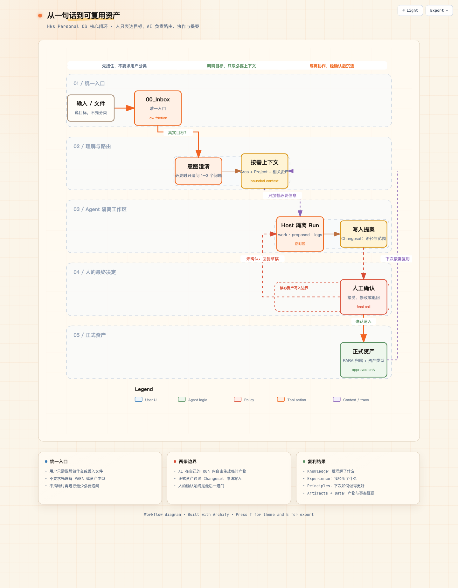
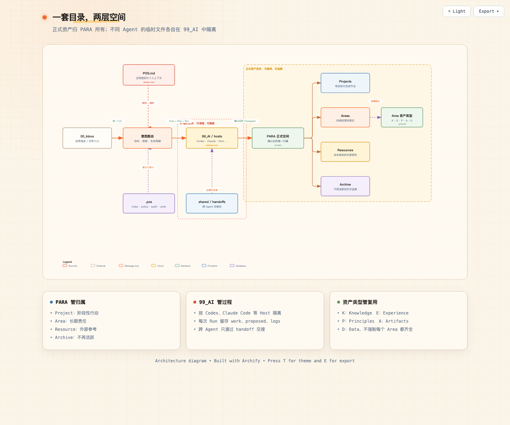
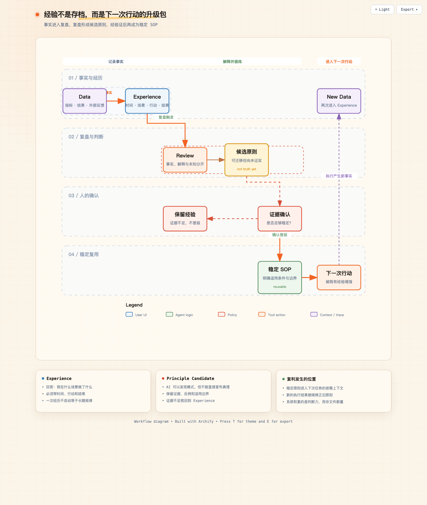
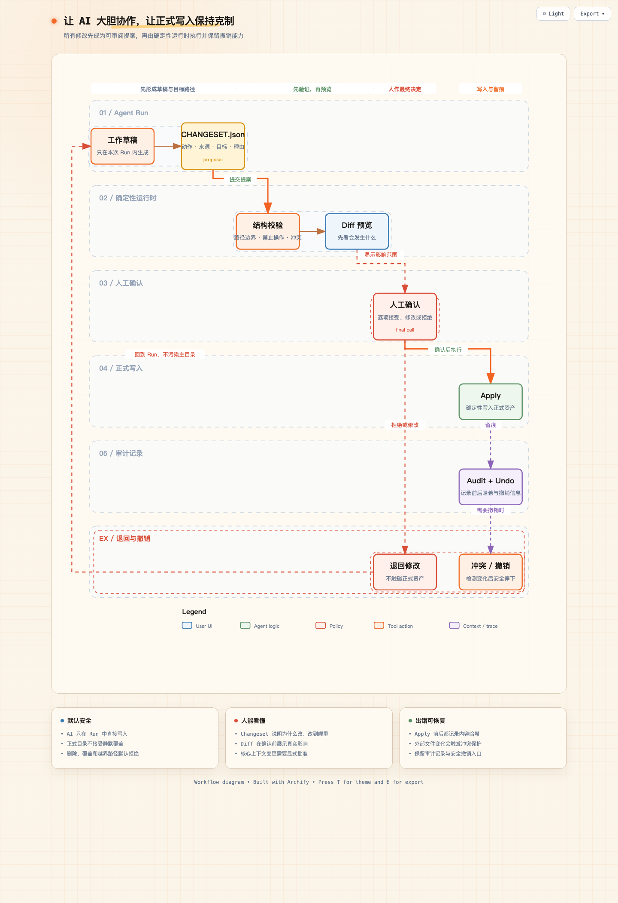

# Hks Personal OS

**简体中文** · [繁體中文](README.zh-TW.md) · [English](README.en.md)

[](https://github.com/HANKSEN/hks-personal-os/releases)
[](SKILL.md)
[](https://github.com/HANKSEN/hks-personal-os/tree/main/tests)
[](https://nodejs.org/)
[](LICENSE)
[](LICENSE-DOCS.md)

> 一套本地优先、Agent 原生的个人信息操作系统，把真实任务中的经验和结果，转化为下一次可调用、可修正的个人上下文。

**Skill 负责创造一次结果，Hks Personal OS 负责让结果产生下一次价值。**

不让 AI 每次从零认识你，也不让它随便接管你的文件。任务做完以后，把这次经验留给下一次。

Hks Personal OS 帮助 AI 实践者建立一套可以持续调用、复用和迭代个人资产的工作系统。

Personal OS 由 Markdown 文件系统、Agent Skill 和 Skill 内置的确定性本地运行时组成。它使用 PARA 管理物理位置，通过 `Knowledge / Experience / Principles / Artifacts / Data` 管理资产意义，并通过隔离 Run 与 Changeset 保护正式文件。全局 `pos` CLI 只是面向高级用户的可选入口，不是普通用户的安装前提。

## 作者：**韩克森（Hanksen）**

**个体认知复利体系的定义者与实践者：帮助个人和组织把 AI 从答案生成器，变成由真实行动持续校准的能力增长系统。**

别人教你怎样使用 AI 和各种工具，我提供让所有 AI 实践持续沉淀为个人或组织能力的操作系统，帮助你把每次 AI 实践变成自己的能力资产。

> [!WARNING]
> 首次授权任何 Agent 访问有价值的文件前，请先完整备份整个目录及附件，并实际验证备份可以恢复。Changeset、Undo、Git 和云端版本历史都不能替代独立备份。详见[安全提示与免责声明](docs/safety.md)。

## 最简单的安装方式

把 [GitHub 仓库链接](https://github.com/HANKSEN/hks-personal-os) 发送给 Codex、Claude Code、WorkBuddy、QCode、Kimi Agent 或其他具备文件与终端能力的 Agent：

```text
请阅读仓库根目录 AGENT_SETUP.md，按其中的安全边界帮我安装 Hks Personal OS。
默认只安装 Skill，不安装全局 CLI。安装后继续问我是新建一套，还是整理已有目录；
每次变更授权范围前先说明精确路径和读写方式，并等我确认。
```

或者运行一行命令：

```bash
npx --yes --package=github:HANKSEN/hks-personal-os personal-os setup --agent auto
```

对于 WorkBuddy、CodeBuddy、TRAE 等命令时限不明确的 Agent，优先使用非交互式软件安装：

```bash
npx --yes --package=github:HANKSEN/hks-personal-os personal-os setup \
  --agent auto --install-only --yes --json
```

`github:` 获取发生在安装器启动前。若出现 `137 / SIGKILL`，可能是 GitHub 链路、宿主命令时限或内存限制，不能只凭退出码认定为代理问题。此时使用 Release `.tgz` 或离线附件，详见[弱网与离线安装](docs/distribution.md)。

在交互式终端中，这条命令会依次完成安装确认、选择“新建/整理已有目录”、路径确认和初始化。默认不创建全局 CLI；只有用户主动需要终端或自动化入口时才添加 `--with-cli`。软件安装、初始化新目录、只读审计旧目录和执行复制迁移始终是四次独立授权。

安装时若检测到 Codex 或 Claude Code 等宿主可注册交互审批适配器，安装计划会显示该动作并默认开启。Codex 使用对话内结构化审批卡；其他宿主仅在原生 MCP 表单能保持可审阅布局时使用原生面板。不支持时自动回退到绑定提案 ID 的文本确认。可用 `--no-interactive-approval` 退出。

### 已安装用户如何更新

把官方仓库或明确版本的 Release 链接交给 Agent，然后说：“阅读 `AGENT_UPDATE.md`，先展示更新计划和路径，等我确认后更新；不要读取我的 Personal OS 数据目录。”更新会校验新旧软件包、自动保留已有可选 CLI、原子切换 Skill 链接并保留旧版本用于回退。旧数据根的 `99_AI` 目录升级是另一项独立授权，不会随软件更新自动执行。详见[版本更新与回退指南](docs/update.md)和[多 Agent 工作区升级](docs/ai-workspaces.md)。

## 一张图看懂



这条链路解决的不是“文件放哪里”这么简单，而是让一次输入经过理解、行动和反馈，最终变成下一次可复用的上下文。

## 适用场景

| 场景 | 常见问题 | Personal OS 提供什么 |
|---|---|---|
| 刚开始使用 Agent | 不知道从哪个目录开始，也不会维护文件 | Inbox 统一入口、最小追问、自动路由 |
| Agent 产物已经很多 | 文件夹乱、重名、难检索、上下文分散 | PARA 目录、元数据索引、按需检索 |
| 阅读与研究 | 收藏很多，但没有形成自己的理解 | Resource 与 Knowledge 分离，保留来源 |
| 项目与创作 | 过程稿、正式版本、数据和复盘混在一起 | Project、Artifact、Data、Experience 分层 |
| 长期复利 | 每次都从头开始，经验没有成为方法 | Experience → Principles → 下一次行动 |
| 高风险文件操作 | Agent 可能误改、覆盖或错误移动 | 隔离 Run、Changeset、审批、审计、Undo |

## 系统地图

根目录用 PARA 管理“内容当前和行动的关系”：



### 多 Agent 如何避免混放

| 维度 | 例子 | 是否建立物理目录 |
|---|---|---|
| Host：实际执行任务的 Agent | Codex、Claude Code、WorkBuddy | 是：`99_AI/hosts/<host-id>/` |
| Role：这次任务采用的能力 | research、creator、builder、reviewer | 否：作为任务元数据，从 Skill 加载 |
| Run：一次具体执行 | 一次文章创作、一次目录审计 | 是：归属于一个 Host |

草稿、生成文件、任务日志和提案留在当前 Run；确认后的长期资产才通过 Changeset 进入 PARA 主目录。换 Agent 接力时，新 Agent 创建自己的 Run，并通过 `shared/handoffs/` 引用交接摘要，不直接改写另一个 Agent 的临时目录。详见[多 Agent 工作区规范](docs/ai-workspaces.md)。

每个 Area 用五类资产回答不同问题：

| 资产 | 回答的问题 | 典型内容 |
|---|---|---|
| `Knowledge` | 我理解了什么？ | 概念、模型、经过消化的认知 |
| `Experience` | 我经历了什么，结果如何？ | 决策、实验、行动记录、复盘 |
| `Principles` | 哪些规律值得再次使用？ | 原则、SOP、方法、Playbook |
| `Artifacts` | 我已经创造了什么？ | 文章、视频、代码、Skill、交付物 |
| `Data` | 有哪些可核查事实？ | 指标、平台导出、测量值、时间序列 |

`Inbox` 是未判断的入口；`Resources` 是已确认主题但尚未形成个人理解的外部资料。外部摘要不会被默认当成用户自己的 `Knowledge`。

## 人和 AI 如何分工

| 环节 | 人负责 | AI / 本地运行时负责 |
|---|---|---|
| 方向 | 目标、价值判断、最终选择 | 发现缺口、提出澄清问题 |
| 理解 | 确认真正诉求与重要背景 | 识别意图、推荐 Area / Project |
| 协作 | 审阅关键内容和风险 | 检索上下文、起草、分析、建立关联 |
| 写入 | 批准 Changeset 和受保护内容 | 校验路径、执行事务、记录审计 |
| 复盘 | 确认经验是否真实、原则是否成立 | 汇总证据、提出 Experience / Principle 候选 |

Skill 负责语义理解；Skill 内置运行时负责确定性的文件操作。运行时本身不会调用模型、推断意图或把数据发送到网络。安装全局 `pos` 只会增加一个命令行快捷入口。

## 经验如何形成复利



## 安全写入流程



V1.2.0 把这个“人工确认”做成了可交互审批：按钮批准的是已预览计划的不可变摘要，不是给 Agent 一次永久写入权。计划变化、文件过期或二次使用都会被拒绝；修改受保护上下文还需独立开关。

V1.2.2 根据真实归档实操补齐了批次安全：同一个任务可以拆成多份独立审批、独立 Undo 的 Changeset；第二批失败不会删除第一批历史。大型数据文件可按原字节复制，面板只展示路径、大小和哈希，避免为了审批而压缩文件或把完整正文塞进聊天窗口；面板超时后提案保持待审批，可直接重新打开。

V1.2.3 修复了原生确认窗口不渲染 Markdown 时的可读性问题。审批摘要改为宿主无关的结构化纯文本，使用【本次计划】、【文件变更】、【允许写入范围】和【审批边界】稳定分区；即使宿主折叠换行，仍能保留清晰的信息边界。完整 ID 和校验信息留在审批记录中，确认窗口聚焦动作、目标路径、风险与写入范围。

V1.2.4 尝试用 Unicode 强制断行符改善 Codex 原生 MCP 表单的换行，但宿主组件仍可能规范化这些字符，因此不能把它当成稳定的跨版本显示保证。

V1.2.5 不再把 Codex 的审批可读性寄托在宿主原生表单如何处理空白字符上。Codex 桌面端优先显示对话内结构化审批卡，用摘要卡、文件表格、允许写入范围和“确认并继续 / 要求修改 / 拒绝 / 暂不处理”按钮完成选择。按钮只回传绑定提案 ID 与完整计划摘要的决策消息；运行时重新核验后才执行，其他 Agent 仍使用原生 MCP 审批或精确文本确认。

V1.2.6 修复审批卡生成脚本中的换行转义错误，并增加生成后 JavaScript 语法解析测试，避免无效脚本进入对话渲染阶段。

V1.2.7 明确停止在 Codex 原生 MCP 表单中承载结构化审批正文：Codex 改用对话内审批卡展示计划、文件、范围与风险，MCP 只负责不可变提案、状态、摘要校验和确定性写入。若误调用原生审批工具，系统只返回审批卡接力信息，不再弹出难以审阅的表单。

- 所有命令都要求明确传入 Personal OS 根目录，不向上搜索；
- 默认 `collaborative` 模式下，正式写入必须先预览并显式添加 `--yes`；
- 修改 `POS.md` 或 `CONTEXT.md` 需要额外批准；
- 支持 `create`、`update`、`move`、`archive`、`trash`，不提供永久删除；
- 拒绝路径穿越、绝对路径、符号链接逃逸以及大小写/Unicode 路径别名；
- Apply 失败会恢复事务前状态，Undo 默认拒绝覆盖后续编辑；
- 导入内容中的 Prompt Injection 只会被当作不可信文本。

## 快速开始

安装完成后，不需要先学命令。新开一个 Agent 会话，直接说：

```text
使用 personal-os Skill 帮我开始。我想新建一套 Personal OS；
请先建议并确认目录路径，再初始化，然后用一个真实任务带我走完第一次路由和预览。
```

如果已经有一堆混乱文件，则说：“帮我只读诊断这个目录，先给整理报告，不要修改原目录。”详见[首次使用指南](docs/first-run.md)和[已有目录整理指南](docs/existing-directory.md)。

## Agent 安装目标

| Agent 宿主 | 安装参数 |
|---|---|
| 自动识别 / 通用 Agents Skills | `--agent auto` |
| Codex | `--agent codex` |
| Claude Code | `--agent claude` |
| OpenClaw / Hermes | `--agent openclaw` / `--agent hermes` |
| WorkBuddy / CodeBuddy | `--agent workbuddy` / `--agent codebuddy` |
| TRAE / TRAE SOLO | `--agent trae` / `--agent trae-solo` |
| Kimi / QCode / Qoder 等 | 对应宿主名，或 `--skill-dir <宿主公布的目录>` |

未知宿主不会被猜测私有路径。完整说明见[安装指南](docs/install.md)、[Agent 适配矩阵](docs/agent-compatibility.md)和[兼容性说明](docs/compatibility.md)。

## 当前状态

- 当前稳定版为 v1.3.1；软件采用 AGPL-3.0-or-later，原创说明文档采用 CC BY-SA 4.0，并提供商业许可路径；
- 已发布的 `v1.0.0` 仍按不可撤销的 MIT License 使用；
- 自动化测试覆盖 Skill-first 安装、完整性校验、原子更新与回退、初始化、只读诊断、复制迁移、多宿主隔离、旧工作区升级、Apply / Undo 和故障恢复；
- 通过 10,000 文件规模的索引与上下文边界测试；
- 覆盖 Apply / Undo 故障恢复、路径逃逸、Prompt Injection 与历史完整性；
- 当前独立验证环境为 macOS；Linux 和 Windows 是兼容目标；
- 支持“旧目录只读 + 复制到新 Personal OS”的审阅式迁移，以及 Codex 对话内审批卡或兼容宿主原生审批面板；不提供默认原地整理、独立完整 GUI、云同步、向量数据库、永久删除或自动外部操作。

## 文档

- [安装指南](docs/install.md)
- [Agent 兼容与安装适配](docs/agent-compatibility.md)
- [弱网、国内网络与离线安装](docs/distribution.md)
- [版本更新与回退](docs/update.md)
- [多 Agent 工作区与旧目录升级](docs/ai-workspaces.md)
- [安全提示与免责声明](docs/safety.md)
- [首次使用指南](docs/first-run.md)
- [已有目录整理指南](docs/existing-directory.md)
- [Setup 状态与授权边界](docs/setup-state-machine.md)
- [两条用户旅程](docs/user-journeys.md)
- [公开设计基础](docs/foundation/README.md)
- [关键设计 RFC](rfcs/README.md)
- [来源与规则溯源](docs/foundation/07-sources-and-provenance.md)
- [Skill 操作协议](SKILL.md)
- [文件体系规范](references/file-system.md)
- [路由协议](references/router.md)
- [安全协议](references/security.md)

公开仓库包含经过脱敏和重写的设计基础、来源追踪及已接受 RFC；原始需求 Spec、技术设计工作底稿、实施任务、验收记录、聊天历史、个人上下文和私有路线图仍不进入发行包。

## License

- 软件、CLI、Skill 与功能性模板：[AGPL-3.0-or-later](LICENSE)
- 原创设计文档与图示：[CC BY-SA 4.0](LICENSE-DOCS.md)
- 闭源集成、免除 ShareAlike 或定制授权：[商业许可说明](COMMERCIAL-LICENSE.md)
- 已发布 `v1.0.0` 的 MIT 许可继续有效：[历史许可文本](LICENSES/MIT-v1.0.0.txt)

完整范围见[许可说明](LICENSING.md)。用户通过 Personal OS 创建或保存的个人内容，不会仅因使用本工具而自动适用上述许可证。

## 共创贡献者

**韩克森（Hanksen）× Codex（OpenAI）**
