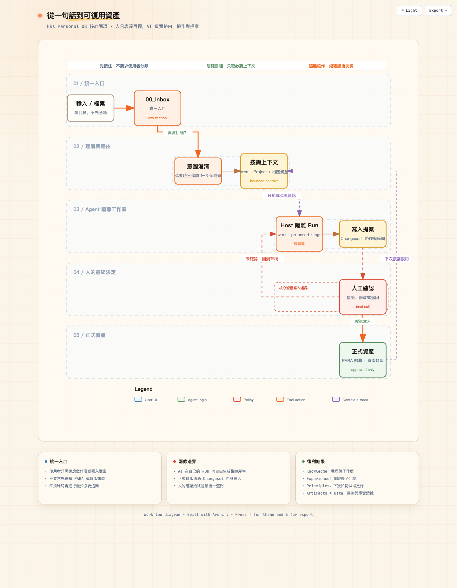
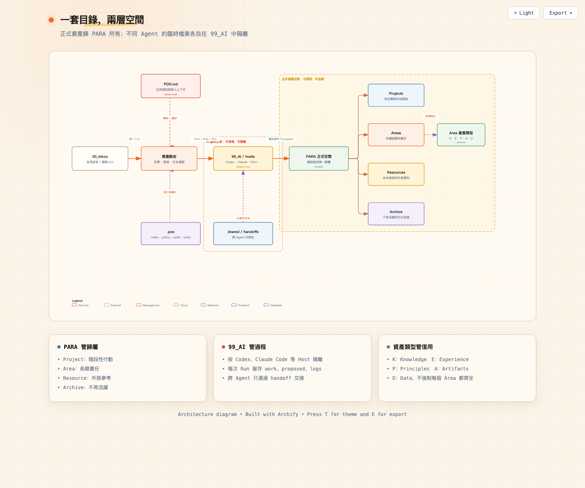
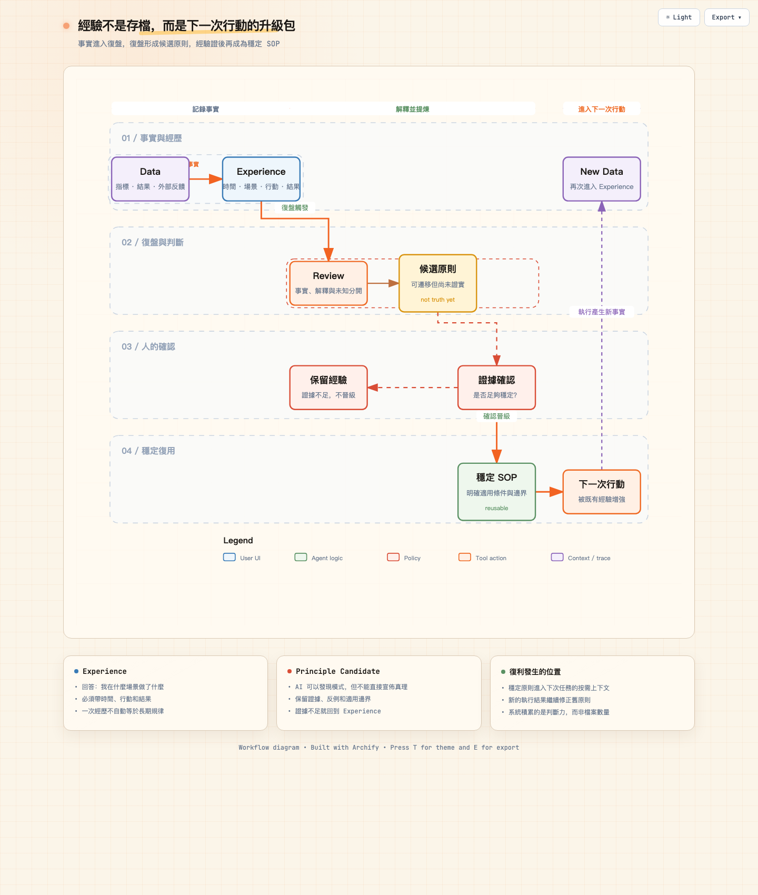
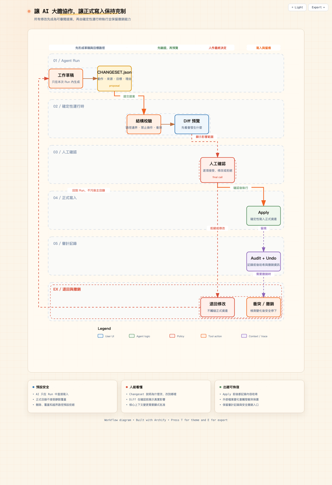

# Hks Personal OS

[簡體中文](README.md) · **繁體中文** · [English](README.en.md)

[](https://github.com/HANKSEN/hks-personal-os/releases/tag/v1.2.2)
[](SKILL.md)
[](https://github.com/HANKSEN/hks-personal-os/tree/main/tests)
[](https://nodejs.org/)
[](LICENSE)
[](LICENSE-DOCS.md)

> 一套本機優先、Agent 原生的個人資訊作業系統，把真實任務中的經驗與結果，轉化為下一次可呼叫、可修正的個人上下文。

**Skill 負責創造一次結果，Hks Personal OS 負責讓結果產生下一次價值。**

不讓 AI 每次從零認識你，也不讓它隨意接管你的檔案。任務完成後，把這次經驗留給下一次。

Hks Personal OS 幫助 AI 實踐者建立一套可以持續呼叫、重用與迭代個人資產的工作系統。

Personal OS 由 Markdown 檔案系統、Agent Skill 與 Skill 內建的確定性本機執行期組成。它使用 PARA 管理實體位置，透過 `Knowledge / Experience / Principles / Artifacts / Data` 管理資產意義，並以隔離 Run 與 Changeset 保護正式檔案。全域 `pos` CLI 是選用入口，不是一般使用者的安裝前提。

## 我是誰：韓克森（Hanksen）

**個體認知複利體系的定義者與實踐者：幫助個人與組織把 AI 從答案生成器，變成由真實行動持續校準的能力增長系統。**

別人教你如何使用 AI 和各種工具，我提供讓所有 AI 實踐持續沉澱為個人或組織能力的作業系統，幫助你把每次 AI 實踐變成自己的能力資產。

> [!WARNING]
> 首次授權任何 Agent 存取有價值的檔案前，請先完整備份整個目錄與附件，並實際驗證備份可以還原。Changeset、Undo、Git 與雲端版本歷史都不能取代獨立備份。詳見[安全提示與免責聲明](docs/safety.md)。

## 最簡單的安裝方式

把 [GitHub 儲存庫連結](https://github.com/HANKSEN/hks-personal-os) 傳送給 Codex、Claude Code、WorkBuddy、QCode、Kimi Agent 或其他具備檔案與終端能力的 Agent：

```text
請閱讀儲存庫根目錄 AGENT_SETUP.md，依照安全邊界幫我安裝 Hks Personal OS。
預設只安裝 Skill，不安裝全域 CLI。安裝後繼續問我是新建一套，還是整理既有目錄；
每次權限範圍改變前，先說明精確路徑與讀寫方式並等我確認。
```

或者執行一行指令：

```bash
npx --yes --package=github:HANKSEN/hks-personal-os personal-os setup --agent auto
```

互動式 Setup 會依序完成安裝確認、選擇新建或整理、路徑確認與初始化。預設不建立全域 CLI；只有使用者主動需要終端或自動化入口時才加入 `--with-cli`。軟體安裝、新目錄初始化、舊目錄唯讀稽核與複製遷移是獨立授權。

安裝時若偵測到 Codex 或 Claude Code 等宿主可註冊互動審批適配器，安裝計畫會顯示該動作並預設開啟。Agent 之後可在支援的對話介面顯示「批准 / 要求修改 / 拒絕 / 取消」；不支援時回退到綁定提案 ID 的文字確認。可用 `--no-interactive-approval` 退出。

### 已安裝使用者如何更新

把官方儲存庫或明確版本的 Release 連結交給 Agent，請它閱讀 `AGENT_UPDATE.md`，先展示更新計畫與路徑，等你確認後更新，且不得讀取 Personal OS 資料目錄。更新會驗證軟體包、保留既有選用 CLI、以交易方式切換 Skill 連結，並保留舊版本供回退。舊資料根的 `99_AI` 結構升級是另一項獨立授權，不會隨軟體更新自動執行。詳見[版本更新與回退指南](docs/update.md)與[多 Agent 工作區升級](docs/ai-workspaces.md)。

## 一張圖看懂



這條鏈路不只解決「檔案放哪裡」，而是讓一次輸入經過理解、行動與回饋，最終成為下一次可重用的上下文。

## 適用場景

| 場景 | 常見問題 | Personal OS 提供什麼 |
|---|---|---|
| 剛開始使用 Agent | 不知道從哪個目錄開始，也不會維護檔案 | Inbox 統一入口、最小追問、自動路由 |
| Agent 產物已經很多 | 資料夾混亂、重名、難檢索、上下文分散 | PARA 目錄、中繼資料索引、按需檢索 |
| 閱讀與研究 | 收藏很多，但沒有形成自己的理解 | Resource 與 Knowledge 分離，保留來源 |
| 專案與創作 | 過程稿、正式版本、數據與複盤混在一起 | Project、Artifact、Data、Experience 分層 |
| 長期複利 | 每次都從頭開始，經驗沒有成為方法 | Experience → Principles → 下一次行動 |
| 高風險檔案操作 | Agent 可能誤改、覆蓋或錯誤移動 | 隔離 Run、Changeset、核准、稽核、Undo |

## 系統地圖

根目錄使用 PARA 管理「內容目前與行動的關係」：



### 多 Agent 如何避免混放

| 維度 | 例子 | 是否建立實體目錄 |
|---|---|---|
| Host：實際執行任務的 Agent | Codex、Claude Code、WorkBuddy | 是：`99_AI/hosts/<host-id>/` |
| Role：本次任務採用的能力 | research、creator、builder、reviewer | 否：作為任務中繼資料，從 Skill 載入 |
| Run：一次具體執行 | 一次文章創作、一次目錄稽核 | 是：歸屬於一個 Host |

草稿、生成檔案、任務日誌與提案留在目前 Run；確認後的長期資產才透過 Changeset 進入 PARA 主目錄。換 Agent 接力時，新 Agent 建立自己的 Run，並透過 `shared/handoffs/` 引用交接摘要，不直接修改另一個 Agent 的暫存目錄。詳見[多 Agent 工作區規範](docs/ai-workspaces.md)。

每個 Area 使用五類資產回答不同問題：

| 資產 | 回答的問題 | 典型內容 |
|---|---|---|
| `Knowledge` | 我理解了什麼？ | 概念、模型、經過消化的認知 |
| `Experience` | 我經歷了什麼，結果如何？ | 決策、實驗、行動記錄、複盤 |
| `Principles` | 哪些規律值得再次使用？ | 原則、SOP、方法、Playbook |
| `Artifacts` | 我已經創造了什麼？ | 文章、影片、程式碼、Skill、交付物 |
| `Data` | 有哪些可核查事實？ | 指標、平台匯出、測量值、時間序列 |

`Inbox` 是尚未判斷的入口；`Resources` 是已確認主題但尚未形成個人理解的外部資料。外部摘要不會被預設視為使用者自己的 `Knowledge`。

## 人與 AI 如何分工

| 環節 | 人負責 | AI / 本機執行期負責 |
|---|---|---|
| 方向 | 目標、價值判斷、最終選擇 | 發現缺口、提出釐清問題 |
| 理解 | 確認真正訴求與重要背景 | 識別意圖、推薦 Area / Project |
| 協作 | 審閱關鍵內容與風險 | 檢索上下文、起草、分析、建立關聯 |
| 寫入 | 核准 Changeset 與受保護內容 | 驗證路徑、執行事務、記錄稽核 |
| 複盤 | 確認經驗是否真實、原則是否成立 | 彙整證據、提出 Experience / Principle 候選 |

Skill 負責語意理解；Skill 內建執行期負責確定性的檔案操作。執行期本身不會呼叫模型、推斷意圖或把資料傳送到網路。全域 `pos` 只是選用快捷入口。

## 經驗如何形成複利



## 安全寫入流程



V1.2.0 將「人工確認」變成可互動審批：按鈕批准的是已預覽計畫的不可變摘要，不是授予 Agent 永久寫入權。計畫變更、檔案過期或重複使用都會被拒絕；修改受保護上下文仍需獨立開關。

V1.2.2 依據真實歸檔實作補齊批次安全：同一個任務可以拆成多份獨立審批、獨立 Undo 的 Changeset；第二批失敗不會刪除第一批歷史。大型資料檔案可以按原始位元組複製，面板只顯示路徑、大小與雜湊，避免為了審批而壓縮檔案或把完整正文塞進聊天視窗；面板逾時後提案仍維持待審批，可直接重新開啟。

- 所有指令都要求明確傳入 Personal OS 根目錄，不向上搜尋；
- 預設 `collaborative` 模式下，正式寫入必須先預覽並明確加入 `--yes`；
- 修改 `POS.md` 或 `CONTEXT.md` 需要額外核准；
- 支援 `create`、`update`、`move`、`archive`、`trash`，不提供永久刪除；
- 拒絕路徑穿越、絕對路徑、符號連結逃逸與大小寫/Unicode 路徑別名；
- Apply 失敗會還原事務前狀態，Undo 預設拒絕覆蓋後續編輯；
- 匯入內容中的 Prompt Injection 只會被視為不可信文字。

## 快速開始

安裝後新開 Agent 工作階段，直接說：

```text
使用 personal-os Skill 幫我開始。我想新建一套 Personal OS；
請先建議並確認路徑，再初始化，然後用一個真實任務帶我完成第一次路由與預覽。
```

若已經有混亂檔案，則說：「幫我唯讀診斷這個目錄，先給整理報告，不要修改原目錄。」詳見[首次使用指南](docs/first-run.md)與[既有目錄整理指南](docs/existing-directory.md)。

## Agent 安裝目標

| Agent 宿主 | 安裝參數 |
|---|---|
| 自動識別 / 通用 Agents Skills | `--agent auto` |
| Codex | `--agent codex` |
| Claude Code | `--agent claude` |
| WorkBuddy、QCode、Kimi 等 | `--agent none --skill-dir <宿主公布的目錄>` |

未知宿主不會被猜測路徑。完整說明見[安裝指南](docs/install.md)與[相容性說明](docs/compatibility.md)。

## 目前狀態

- 目前穩定版為 v1.2.2；軟體採用 AGPL-3.0-or-later，原創說明文件採用 CC BY-SA 4.0，並提供商業授權途徑；
- 已發佈的 `v1.0.0` 仍依不可撤銷的 MIT License 使用；
- 自動化測試涵蓋 Skill-first 安裝、初始化、唯讀診斷、複製遷移、多宿主隔離、舊工作區升級、Apply / Undo 與故障復原；
- 通過 10,000 個檔案規模的索引與上下文邊界測試；
- 涵蓋 Apply / Undo 故障復原、路徑逃逸、Prompt Injection 與歷史完整性；
- 目前獨立驗證環境為 macOS；Linux 與 Windows 是相容目標；
- 支援「舊目錄唯讀 + 複製到新 Personal OS」的審閱式遷移與宿主原生審批面板；不提供預設原地整理、獨立完整 GUI、雲端同步、向量資料庫、永久刪除或自動外部操作。

## 文件

- [安裝指南](docs/install.md)
- [版本更新與回退](docs/update.md)
- [多 Agent 工作區與舊目錄升級](docs/ai-workspaces.md)
- [安全提示與免責聲明](docs/safety.md)
- [首次使用指南](docs/first-run.md)
- [既有目錄整理指南](docs/existing-directory.md)
- [Setup 狀態與授權邊界](docs/setup-state-machine.md)
- [兩條使用者旅程](docs/user-journeys.md)
- [公開設計基礎](docs/foundation/README.md)
- [關鍵設計 RFC](rfcs/README.md)
- [來源與規則溯源](docs/foundation/07-sources-and-provenance.md)
- [Skill 操作協議](SKILL.md)
- [檔案系統規範](references/file-system.md)
- [路由協議](references/router.md)
- [安全協議](references/security.md)

公開儲存庫包含經過脫敏與重寫的設計基礎、來源追蹤及已接受 RFC；原始需求 Spec、技術設計工作底稿、實施任務、驗收記錄、對話歷史、個人上下文與私有路線圖仍不進入發行套件。

## License

- 軟體、CLI、Skill 與功能性範本：[AGPL-3.0-or-later](LICENSE)
- 原創設計文件與圖示：[CC BY-SA 4.0](LICENSE-DOCS.md)
- 閉源整合、免除 ShareAlike 或客製授權：[商業授權說明](COMMERCIAL-LICENSE.md)
- 已發佈 `v1.0.0` 的 MIT 許可持續有效：[歷史許可文字](LICENSES/MIT-v1.0.0.txt)

完整範圍見[許可說明](LICENSING.md)。使用者透過 Personal OS 建立或儲存的個人內容，不會僅因使用本工具而自動適用上述許可。

## 共創貢獻者

**韓克森（Hanksen）× Codex（OpenAI）**
