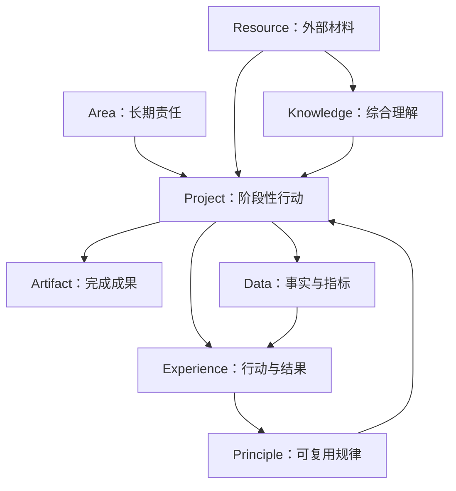

# 概念模型

Personal OS 使用三个正交维度描述内容，避免用一棵目录同时表达所有意义。

## 三个维度

| 维度 | 回答的问题 | 取值示例 |
|---|---|---|
| 行动关系 | 它现在为何存在、由谁负责？ | Project、Area、Resource、Archive |
| 资产语义 | 它作为长期资产是什么？ | Knowledge、Experience、Principle、Artifact、Data |
| 生命周期 | 它现在处于什么状态？ | idea、active、review、completed、archived，或用户自定义状态 |

物理目录优先表达行动关系；元数据、子目录和链接表达资产语义及生命周期。状态允许按 Area 或 Project 自定义，系统不强制一套词表。

## PARA 骨架

- `10_Projects`：有明确目标和完成条件的阶段性工作。
- `20_Areas`：没有预定终点、需要持续经营的责任领域。
- `30_Resources`：已经知道主题与可能用途，但尚未转化为个人理解的外部材料。
- `90_Archive`：不再活跃但仍需保留来源、历史或未来价值的内容。
- `00_Inbox`：PARA 之前的统一入口，归属和用途尚未确定。
- `99_AI`：Agent 的隔离运行、提案、审计辅助和软删除空间。

## 五类正式资产

### Knowledge：我理解了什么

经过综合、可解释、未来可复用的个人理解。外部原文和仅由 AI 生成的摘要不是自动成立的 Knowledge。

### Experience：我经历了什么

具有时间、背景、行动/选择、结果和反思的记录，包括实验、决策和复盘。它保留具体情境，不追求假装普遍适用。

### Principles：什么值得再次使用

由 Experience、Data 或其他明确证据支持的原则、SOP、方法和 Playbook。单次观察通常先作为候选，用户确认后才成为稳定原则。

### Artifacts：我创造并交付了什么

已完成、发布或可复用的成果，例如文章、视频、代码、Skill、报告和产品交付物。创作过程仍属于 Project，不应与正式 Artifact 混放。

### Data：有哪些可核查事实

平台导出、指标、测量、时间序列和结构化事实。Data 支持复盘，但数据本身不自动解释原因。

## 关系模型

## 创作示例

| 阶段 | 位置/类型 |
|---|---|
| 一个尚未判断是否写的想法 | Inbox，或创作 Area 的候选列表 |
| 已决定完成一个系列 | Project |
| 研究、提纲、草稿、图片 | Project/Working |
| 发布后的规范文章 | 创作 Area/Artifacts |
| 平台导出和点击率 | 创作 Area/Data |
| 一次内容表现复盘 | 创作 Area/Experience |
| 多次验证后的内容生产 SOP | 创作 Area/Principles |
| 将 SOP 实现成可安装 Skill | 新 Project；完成后成为 Artifacts |

## 投资研究示例

| 内容 | 类型 |
|---|---|
| 研报、长文、公司公告 | Resources |
| 自己整合的产业链模型 | Knowledge |
| 当时的选择、依据、仓位思考和结果 | Experience（decision/review 子类型） |
| 市场价格、财报指标、交易日志 | Data |
| 经多次验证的筛选规则或复盘清单 | Principles |
| 对外发布的研究文章或工具 | Artifacts |

此模型只组织研究与认知，不构成投资建议，也不授权 Agent 自动交易。
