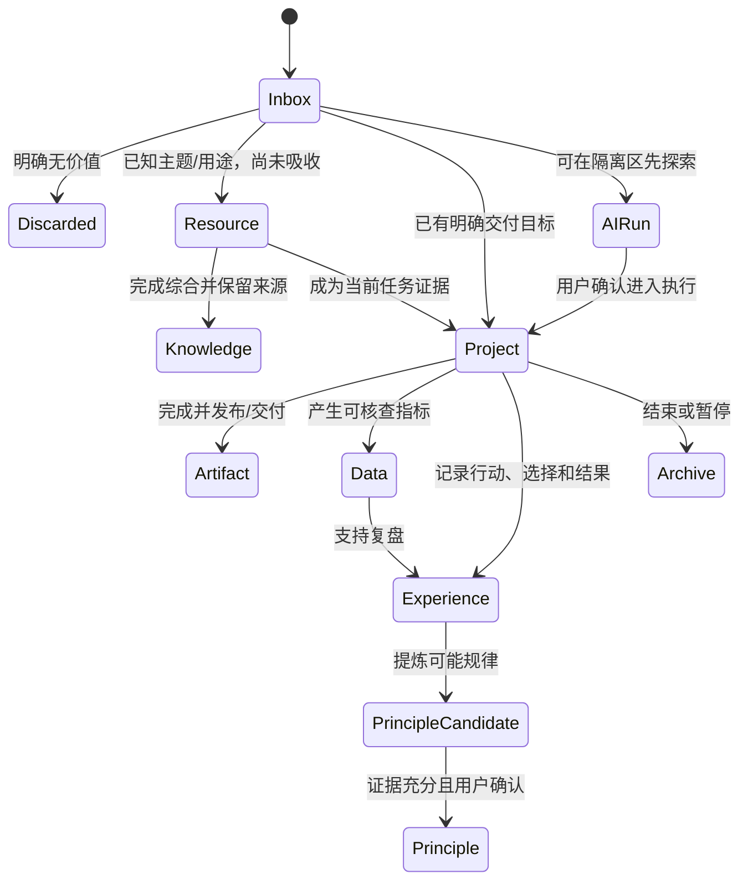

# 信息生命周期

## Inbox 与 Resources 的边界

`Inbox` 不是长期资料库，而是“用途和归属尚未确定”的入口；`Resources` 是“用途或主题已经确认，但尚未形成个人理解”的外部材料。

| 状态 | 已知信息 | 应在何处 |
|---|---|---|
| 只知道“以后可能有用” | 用途、Area、Project 均未知 | Inbox |
| 已知属于某主题，暂时只保留原文 | Area/主题已知，尚未综合 | Resources |
| 只为当前交付物提供证据 | Project 已知 | Project/Research 或 Evidence |
| 已形成自己的可复用理解 | 有综合、来源和应用 | Knowledge |
| 已变成可执行步骤并有证据 | 可重复使用 | Principles |

## 通用数据流

## 路由步骤

1. 识别用户期望发生的变化和交付物，而非只看关键词。
2. 判断缺失信息是否会改变主要所有者、交付物、持久化、风险或外部动作。
3. 必要时只追问一个最能消除分歧的问题。
4. 优先复用已有活跃 Project；否则选择一个主要 Area。
5. 从索引取回核心、领域、项目和少量相关资产。
6. 在隔离 Run 完成分析或草稿，记录使用过的上下文。
7. 把正式变更编码为 Changeset，预览后由用户批准。
8. 更新索引和审计；需要时从结果中提出 Experience 或 Principle 候选。

## 单一规范副本

同一篇正式文章不应同时在 Project、Area 和一个全局 Artifacts 目录保存三份。推荐做法是：

- 生产期间以 Project 内文件为工作副本；
- 发布后把批准版本提升为所属 Area 的 Artifact；
- Project、Knowledge 和 Experience 通过稳定 ID 或相对链接引用该 Artifact；
- 平台特定导出若必须保留，标明它们是衍生版本而非新的规范副本。

## 原则升级门槛

AI 可以从一次复盘提出 `principle-candidate`，但只有满足以下条件才建议升级：

- 有明确的 Experience 或 Data 证据；
- 适用条件、例外和失效信号可描述；
- 不与现有稳定原则冲突，或冲突已显式说明；
- 用户确认这是自己愿意在后续行动中采用的规则。

## 归档与删除

不活跃的 Project、Area 或 Resource 进入 Archive 并保留来源关系。可能删除的内容先进入 `99_AI/trash`。v1 不提供永久删除操作；用户若在系统外删除，责任和恢复方式由其文件系统或备份承担。
