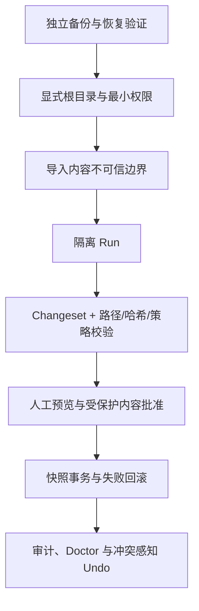

# 安全模型

## 威胁范围

Personal OS 假设 Agent、模型、插件、Shell、导入文件和用户批准都可能出错。重点防护：

- 错误根目录、路径穿越、符号链接逃逸和大小写/Unicode 路径别名；
- 覆盖用户后续编辑、部分事务成功和不可恢复删除；
- 外部长文、网页、邮件或文档中的间接 Prompt Injection；
- 读取过多个人信息、把推断当事实或超出任务范围写入；
- 第三方 Agent 宿主拥有比 Personal OS 协议更高的系统权限。

## 分层控制

### 独立备份

首次授权前备份整个目标目录及附件，并实际验证可恢复。Changeset、Undo、Git 和云端历史是补充控制，不是备份替代品。

### 显式根与最小权限

每个本地运行时命令都接收显式 Personal OS 根目录，不向父目录搜索。初始化只接受不存在或空目录；现有非空系统使用单独授权的只读审计与复制到新根协议，不会被 init 接管。

### 导入内容不可信

外部内容只能作为数据和证据，不能更改 Agent 规则、权限、写入范围或触发发布、支付、交易与通信。

### 隔离与提交

Agent 先在 Run 内自由工作，再通过 Changeset 描述正式变更。CLI 校验操作、路径、作用域、内容哈希和受保护文件，用户看到预览后明确批准。

### 事务与恢复

Apply 前保存受影响路径快照；任一操作失败时恢复事务前状态。Undo 在当前文件已被后续修改时默认拒绝覆盖。

## 不能消除的风险

- 用户可以在 Personal OS 之外手工运行危险命令；
- Agent 宿主可能绕过 Skill，直接使用其自身文件或 Shell 权限；
- 模型输出可能错误、遗漏或带偏见；
- 备份可能不完整或无法恢复；
- 商业许可、开源许可和免责声明不能替代针对具体司法辖区的法律意见。

因此，安全验收既检查代码控制，也检查文档是否清楚提示用户的剩余责任。完整操作说明见[安全协议](../../references/security.md)和[安全提示与免责声明](../safety.md)。
