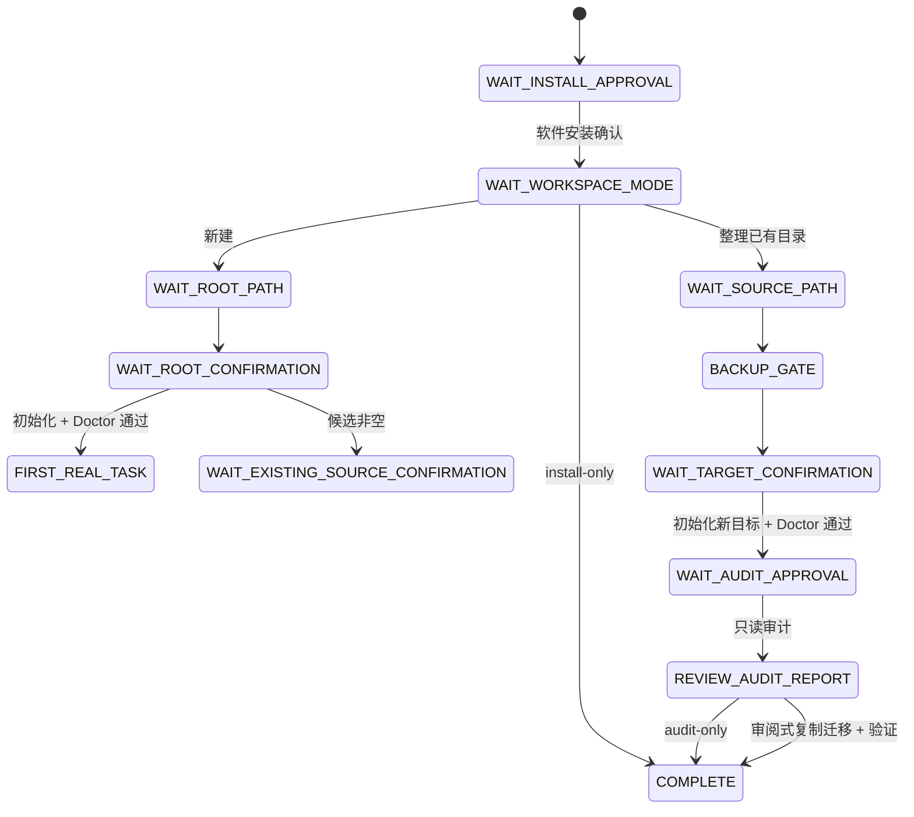

# Setup 状态机与授权边界

本文公开的是用户可观察的 setup 协议，不包含内部需求工作底稿。所有机器输出使用 `personal-os.setup.v1`，Agent 应依据 `state`、`pendingAuthorization` 和 `nextAction` 继续，不应把一次授权扩展到后续步骤。

## 顶层状态



`ABORTED` 表示用户取消；`RECOVERABLE_FAILURE` 表示修正路径、权限或冲突后可以继续。已初始化根会进入 `HEALTH_CHECK`，而不是重复 init。

## 四个独立权限门

| 权限门 | 允许 | 不允许推断 |
|---|---|---|
| 软件安装 | 写版本包和明确 Skill 入口 | 读取或初始化数据目录 |
| 新根初始化 | 写一个确认过的缺失/空目录 | 写父目录的其他内容或接管非空目录 |
| 旧根只读审计 | 读取一个精确源根 | 写、移动、删除源文件或读取父目录 |
| 迁移与 Apply | 把已审项目复制到新目标的明确范围 | 修改源目录或静默覆盖冲突目标 |

修改 `POS.md`、`CONTEXT.md` 等受保护上下文还需要额外批准。

## 机器输出示例

```json
{
  "schema": "personal-os.setup.v1",
  "state": "WAIT_ROOT_CONFIRMATION",
  "journey": "new",
  "installation": {
    "skillInstalled": true,
    "globalCliInstalled": false,
    "embeddedRuntime": "/installed/package/scripts/pos.mjs"
  },
  "workspace": {
    "candidateRoot": "/absolute/path/to/Personal_OS",
    "candidateState": "missing",
    "authorizedAccess": "none"
  },
  "pendingAuthorization": {
    "operation": "initialize-new-root",
    "access": "write"
  },
  "nextAction": {
    "type": "ask-user",
    "promptKey": "confirm-new-root"
  }
}
```

## 路径状态

| 检测结果 | Setup 行为 |
|---|---|
| `missing` / `empty` | 展示绝对路径，等待初始化确认 |
| `initialized` | 读取根标记并运行健康检查 |
| `non-empty` | 拒绝 init，转到已有目录旅程 |
| `symlink` / `not-directory` / `invalid-personal-os` | 停止并选择安全路径 |

新根初始化先在同级临时目录生成并通过 Doctor，再原子移动到确认路径；提交前失败会清理临时状态，不把半成品报告为成功。

## 完成条件

Setup 只有在以下证据齐全时才可以报告完成：

- Skill 目标和内置运行时可用；
- 选择的数据根及访问方式已明确；
- 新根或迁移目标通过 Doctor；
- 旧目录旅程的源摘要未被本系统改变；
- 所有正式变化已经预览并取得相应批准；
- 返回下一条自然语言操作、未决项和可用 Undo ID。
